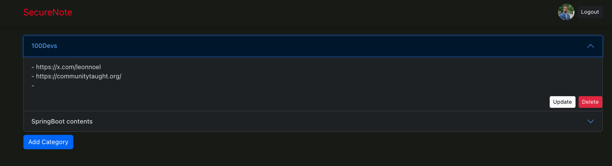

# SecureNote
A place where you put those links you might need for later



## How It's Made:

Tech used: 
- **Java: 17**
- **OAuth2.0** 
- **SpringBoot: 3** 
- **Thymeleaf**

The project uses the current industry standard OAuth2.0 for Authorization currently supporting both Google and GitHub
as Authorization providers. In short users to need to create a password to access and use the application.

### Installation
To install and run this project on your local machine follow the following steps, make sure not to skip steps.

**Requirements**
- ```Docker``` is installed and running
- No running instance of ```Postgress``` 
- patience

Steps
```shell
# Clone project
git clone https://github.com/NatnaelSisay/SecureLinks.git
cd SecureLinks
```
```shell
# create .env file, copy the content of example.env and paste them in .env file
# this steps is added to create friction, to make sure you are serious about trying the app
touch .env
cat example.env >> .env
```

```
# Script to build jar file
# chmod +x script.sh
source script.sh
```
```
# Running application
docker-compose up
```

If everything goes successfully without an error
Visit [localhost:8080](http://localhost:8080)


## Optimizations
- Optimized sorting for Items, to show recently updated to the top
- Deploy application on AWS(EC2 or ECS/Farget)

## Lessons Learned:

Learning how OAuth2 works and the difference b/n OIDC(Open Id connect) and OAuth was eye opening experience. For future reference
Google provides OIDC and GitHub don't provide that, knowing that will enable us to customize our support for different authorization servers.

## Examples:
Take a look at these couple examples that I have in my own portfolio:

**Palettable:** https://github.com/alecortega/palettable

**Twitter Battle:** https://github.com/alecortega/twitter-battle

**Patch Panel:** https://github.com/alecortega/patch-panel


